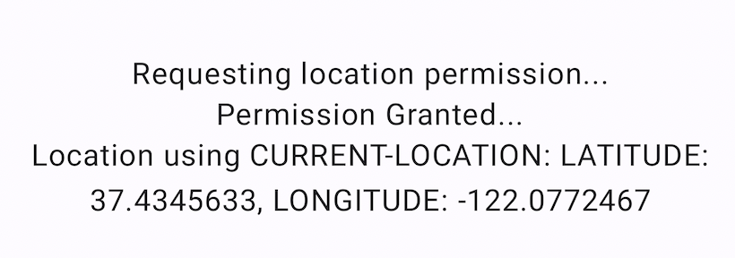

<h1 align="center">GetLocationCompose</h1> 

<p align="center">
This app was created to learn about how to request location permissions and how to obtain the user's location
</p>

## Installation

Clone this repository and import into **Android Studio**

```bash
git clone https://github.com/munbonecci/GetLocationCompose.git
```

## Build variants

Use the Android Studio *Build Variants* button to choose between **debug** and **release**
flavors

## Maintainers

This project is maintained by:

* [Edmundo Bonequi](http://github.com/munbonecci)

## Built with

- [Kotlin](https://kotlinlang.org/) - For coding.
- [Location](https://developer.android.com/develop/sensors-and-location/location/retrieve-current)
  -For retrieve Location.
- [Permissions](https://google.github.io/accompanist/permissions/) -For Permissions.
- Jetpack
    - [Compose](https://developer.android.com/jetpack/compose?gclid=CjwKCAiAzKqdBhAnEiwAePEjkkbfP8b_r6c57F3jtdwOjxWpBbNOXVmpSnAUu4HKCid7KtSvfiiYeRoC1wYQAvD_BwE&gclsrc=aw.ds)
        - Android’s recommended modern toolkit for building native UI.

## How I run the app?

- Clone the repository
- Open it in Android Studio
- Wait until dependencies are installed
- Run app in your emulator or physical device


